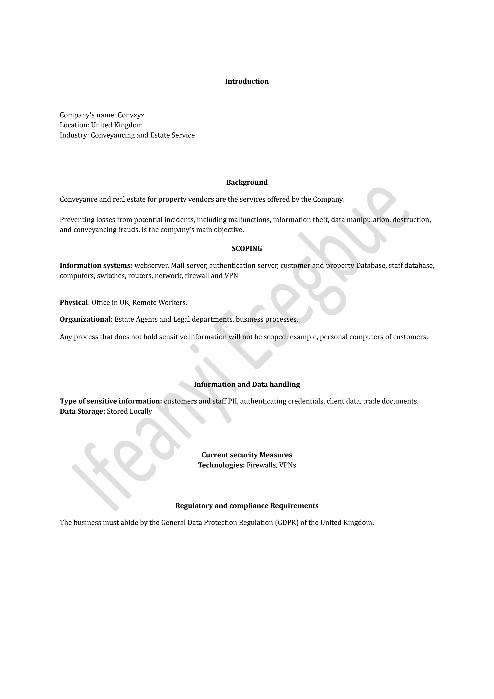
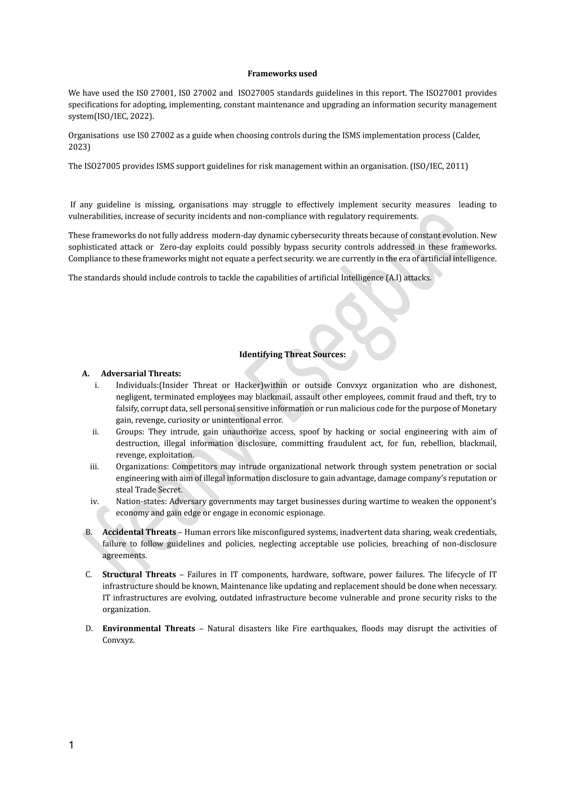
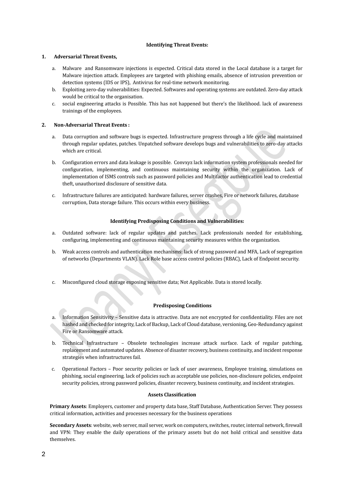
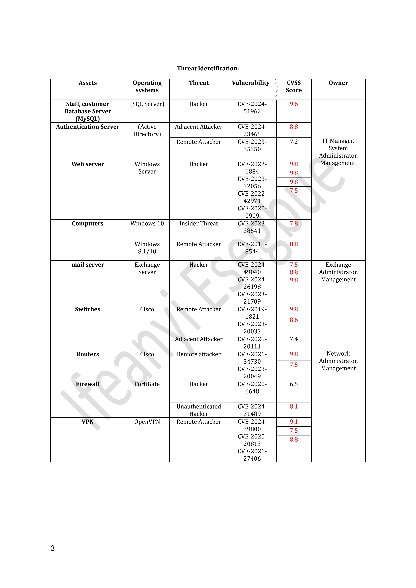
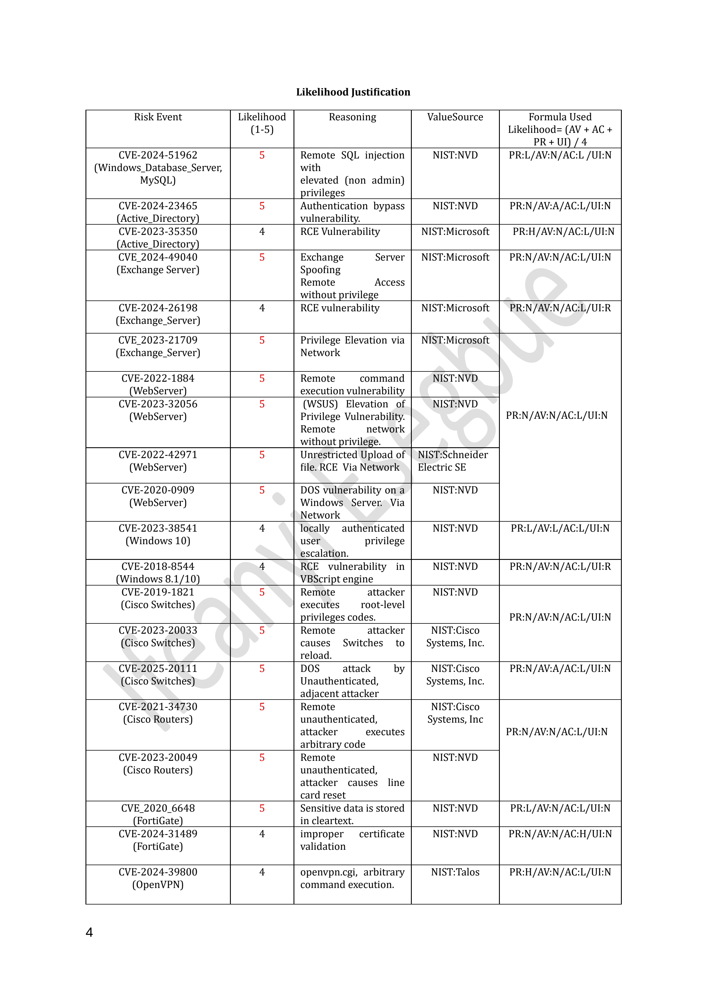
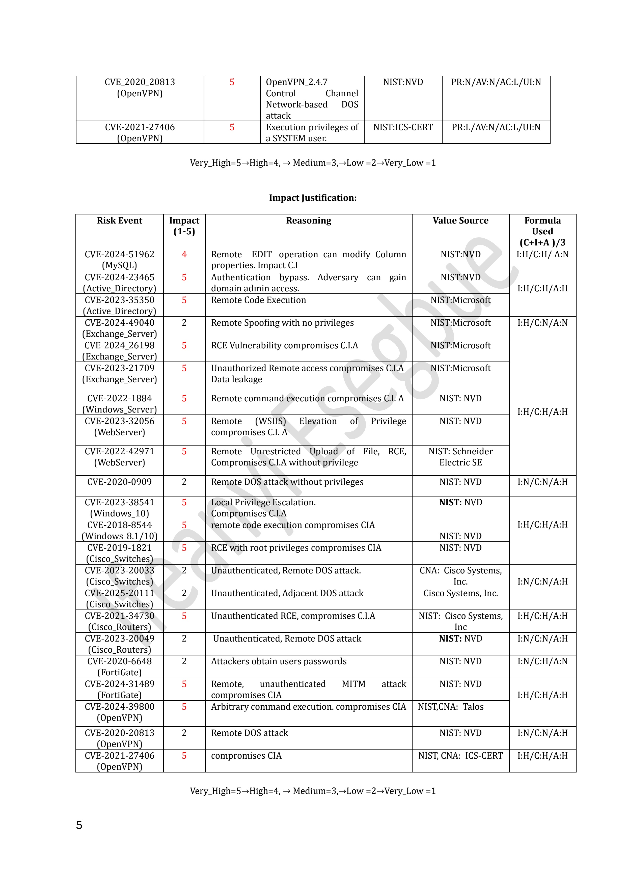
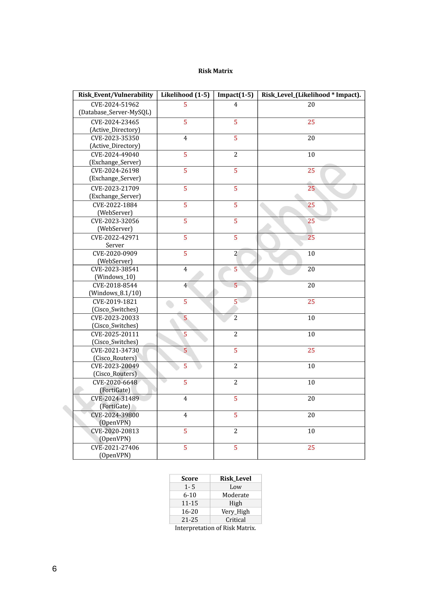
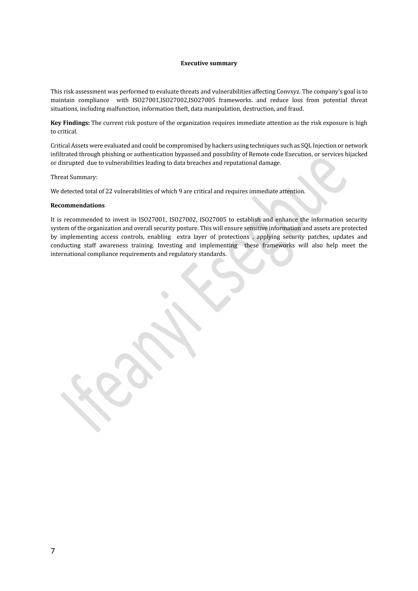
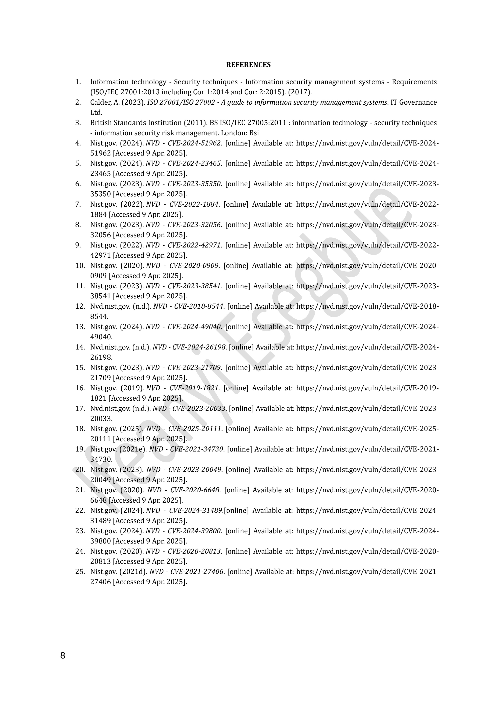

# Cybersecurity Risk Assessment

**Title:** Risk Assessment & Mitigation Report  
**Target Environment:** Convxyz 

##  Project Overview
This repository contains a comprehensive cybersecurity risk assessment conducted for **Convxyz**, a simulated enterprise architecture. The project demonstrates practical skills in identifying operational vulnerabilities, evaluating threat vectors, mapping assets, and designing strategic risk mitigation using frameworks. 

### Core Competencies Demonstrated:
* **Threat Modelling:** Identification of potential threat actors and attack surfaces.
* **Vulnerability Analysis:** Assessment of systemic, network, and human-factor risks.
* **Risk Quantification:** Evaluating the likelihood and business impact of potential exploits.
* **Mitigation Strategy:** Developing actionable, cost-effective security controls aligned with industry standards (e.g., NIST, ISO 27001).
* 
## 📄 Risk Assessment Report

